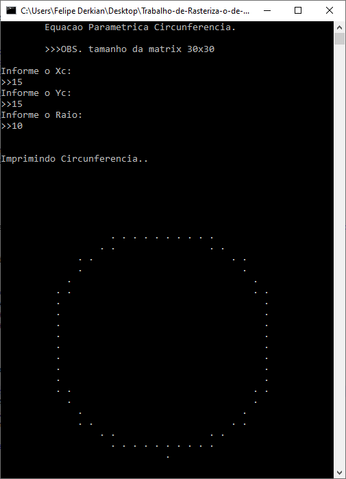
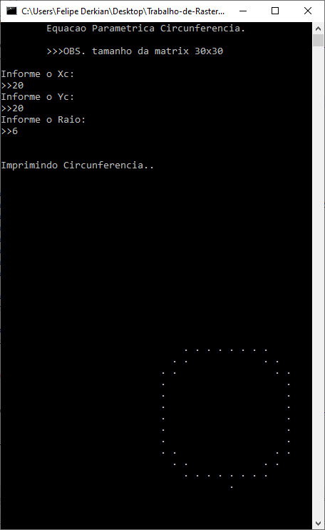
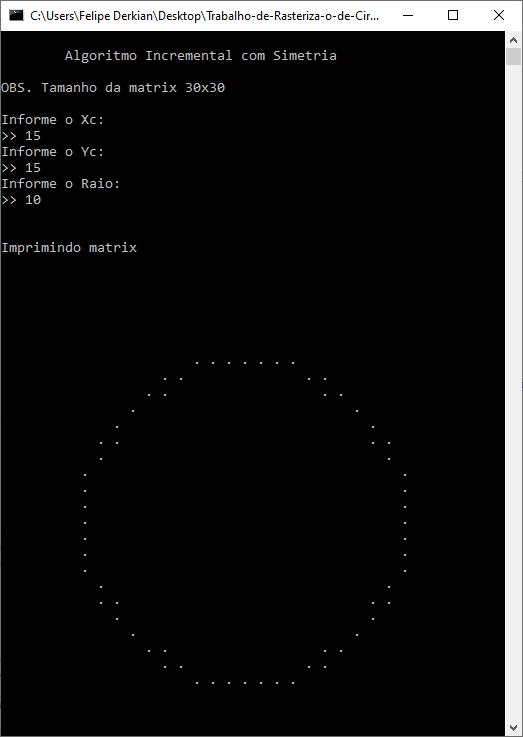
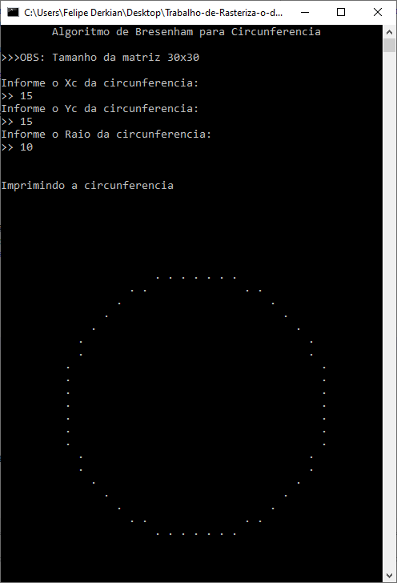

# RASTERIZAÇÃO DE CIRCUNFERÊNCIAS COM EQUAÇÃO PARAMÉTRICA, BRESENHAM E INCREMENTAL COM SIMETRIA

## [_**DOCUMENTO ESCRITO DISPONÍVEL NO SEGUINTE LINK**_](https://github.com/felipekian/RASTERIZACAO-DE-CIRCUNFERENCIAS-COM-EQUACAO-PARAMETRICA-E-BRESENHAM-E-INCREMENTAL-COM-SIMETRIA/tree/master/Trabalho%20Escrito)

## ALGORITMO EQUAÇÃO PARAMÉTRICA PARA CIRCUNFERÊNCIA

O algoritmo tem esse nome por utilizar a equação paramétrica da circunferência. Ele é um algoritmo utilizar para rasterizar os melhores pixeis para formar a circunferência.

### PONTOS POSITIVOS DO ALGORITMO EQUAÇÃO PARAMÉTRICA

Ele é um algoritmo que faz um bom trabalho para circunferências pequenas e com poucas gerações de circunferência.

### PONTOS NEGATIVOS DO ALGORITMO EQUAÇÃO PARAMÉTRICA

Ele é um algoritmo pesado para se usar em grande escala por usar aritmética de ponto flutuante, arredondamentos, o mesmo pixel é marcado várias vezes na maioria das vezes e é limitar
a 360 pontos, ou seja, se a circunferência for muito grande haverá falhas por essa limitação do algoritmo.

### DESEMPENHO DO ALGORITMO

O algoritmo tem um desempenho ruim, pois faz operações sem necessidade principalmente para circunferências pequenas onde o mesmo ponto é marcado várias vezes sem necessidade, além
de utilizar aritmética com ponto flutuante e arredondamentos que para o computador é muito custoso.

### PSEUDO CÓDIGO
```
Função EqParametrica recebe xc, yc e o raio:
  x recebe xc mais raio
  y recebe yc
  para t de 1 até 360 faça:
    marca o pixel na posição (x,y) com uma cor
    x = xc + r*cos(pi*t/180)
    y = yc + r*sen(pi*t/180)
```

### CÓDIGO EM LINGUAGEM C
```
void equacaoParametrica(int matrix[TAM_MATRIX][TAM_MATRIX], int xc, int yc, int raio){
  int x,y,i;
  x = xc + raio;
  y = yc;
  for(i=0 ; i<360 ; i++){
    matrix[x][y] = BORDA;
    x = xc + raio * cos( (PI * i) / 180);
    y = yc + raio * sin( (PI * i) / 180);
  }
}
```

###   CÓDIGO FONTE

[_*LINK PARA O CÓDIGO FONTE*_](https://github.com/felipekian/RASTERIZACAO-DE-CIRCUNFERENCIAS-COM-EQUACAO-PARAMETRICA-E-BRESENHAM-E-INCREMENTAL-COM-SIMETRIA/tree/master/Equa%C3%A7%C3%A3o_Parametrica)

### PROGRAMA EM EXECUÇÃO COM RESULTADOS





---

## ALGORITMO INCREMENTAL COM SIMETRIA

O algoritmo Incremental com Simetria é uma evolução do Paramétrico, sendo mais eficiente por processar apenas o primeiro octante e espelhar o resultado para os demais octantes apenas
invertendo x por y e y por x e trocando os sinais quando necessário. Com isso, tem um desempenho muito melhor que o Paramétrico.

### PONTOS FORTES DO INCREMENTAL COM SIMETRIA

Os pontos fortes desse algoritmo são em primeiro lugar processar apenas 12,5% da circunferência a ser plotada que corresponde a 1 octante da circunferência, utiliza espelhamento de
cada ponto processado invertendo x por y e y por x e se e trocando sinais formando os outros 87,5% do restante da circunferência.

### PONTOS FRACOS DO INCREMENTAL COM SIMETRIA

Utiliza aritmética com ponto flutuante e arredondamento que são operações custosos para o processador do computador.

### DESEMPENHO DO INCREMENTAL COM SIMETRIA

É um algoritmo bem mais eficiente que o Paramétrico por processar apenas 12,5% da circunferência, mas continua usando aritmética com ponto flutuante e arredondamento que são
operações pesadas para o computador processar.

### PSEUDO CÓDIGO
```
Função Incremental com Simetria recebe os parâmetros xc, yc e o raio:
  angulo_treta = 1/raio
  cosseno = cos(angulo_treta)
  seno = sin(angulo_treta)
  x=raio
  y=0
  enquanto x<=y faça:
    seta o pixel(x,y,cor) x8 modificando as posições de x e y
    x = x*cosseno – y*seno
    y = y*cosseno +x*seno
```

### CÓDIGO EM LINGUAGEM C
```
void plotarMatrix(int matrix[TAM_MATRIX][TAM_MATRIX], int x,int y, int xc, int yc){
  matrix[y+yc][x+xc] = BORDA;
  matrix[x+xc][y+yc] = BORDA;
  matrix[x+xc][-y+yc] = BORDA;
  matrix[y+yc][-x+xc] = BORDA;
  matrix[-y+yc][-x+xc] = BORDA;
  matrix[-x+xc][-y+yc] = BORDA;
  matrix[-x+xc][y+yc] = BORDA;
  matrix[-y+yc][x+xc] = BORDA;
  return;
}

void incrementalComSimetria(int matrix[TAM_MATRIX][TAM_MATRIX], int xc, int yc, int raio)
{
  double teta = (double) 1/raio;
  double cosseno = cos(teta);
  double seno = sin(teta);
  double x = raio;
  double y = 0.0;
  
  while(y<=x){
    plotarMatrix(matrix, round(x), round(y), xc, yc);
    x = (double)(x*cosseno)-(y*seno);
    y = (double)(y*cosseno)+(x*seno);
  }
}
```

###   CÓDIGO FONTE

[_*LINK PARA O CÓDIGO FONTE*_](https://github.com/felipekian/RASTERIZACAO-DE-CIRCUNFERENCIAS-COM-EQUACAO-PARAMETRICA-E-BRESENHAM-E-INCREMENTAL-COM-SIMETRIA/tree/master/Incremental_Com_Simetria)

### PROGRAMA EM EXECUÇÃO COM RESULTADOS




---

## ALGORITMO DE BRESENHAM PARA CIRCUNFERÊNCIA

O algoritmo de Bresenham é um avanço do algoritmo de Incremental com Simetria, ele é ainda mais eficiente e gera circunferência muito boas e com bastante eficiência pois evita utilizar raízes,
potências, funções trigonométricas. Mas ainda usa arredondamentos e aritmética com ponto flutuante. O Bresenham analisou que para rasterizar uma circunferência sempre recai sobre três
pixeis e ele seleciona o pixel mais próximo da curva ideal, sendo o critério de seleção leva em conta a distância relativa entre os pixeis e a circunferência ideal.


### PONTOS FORTES DO BRESENHAM PARA CIRCUNFERÊNCIA
É o algoritmo mais eficiente computacionalmente, elemina grade parte das funções pesadas que os outros algoritmos utilizavam.

### PONTOS FRACOS DO BRESENHAM PARA CIRCUNFERÊNCIA
Em um caso de teste com os pontos (22,25) com raio 5 o algoritmo falhou. Então ele também tem suas limitações.

### PSEUDO CÓDIGO
```
Função Bresenham recebe xc, yc e raio:
  x=0
  y=r
  paramentro = 5/4-r ou 1-r
  enquanto x for diferente de y faça:
    SetPixel(x+xc, y+yc, cor)
    se parametro for maior ou igual 0 faça:
      y=y-1
      parametro=parametro+2*x-2*y+5
      x=x+1
    senão faça:
      parametro=parametro+2*x+3
      x=x+1
      SetPixel(x+xc, y+yc, cor) // 8 Demais octantes
```

### CÓDIGO EM LINGUAGEM C
```
void plotarMatrix(int matrix[TAM_MATRIX][TAM_MATRIX], int x,int y, int xc, int yc){
  matrix[y+yc][x+xc] = BORDA;
  matrix[x+xc][y+yc] = BORDA;
  matrix[x+xc][-y+yc] = BORDA;
  matrix[y+yc][-x+xc] = BORDA;
  matrix[-y+yc][-x+xc] = BORDA;
  matrix[-x+xc][-y+yc] = BORDA;
  matrix[-x+xc][y+yc] = BORDA;
  matrix[-y+yc][x+xc] = BORDA;
  return;
}
void Bresenham_circunferencia(int matrix[TAM_MATRIX][TAM_MATRIX], int xc, int yc, int raio){
  int x,y;
  x = 0;
  y = raio;
  double p = 1-raio; //ou p = 1-raio ou (5/4)-raio;
  plotarMatrix(matrix, x,y,xc,yc);
  while(x<y){
    x++;
    if(p<0){
      p = p+2*x+1;
    }else{
      y--;
      p = p+2*x+1-2*y;
    }
    plotarMatrix(matrix, x,y,xc,yc);
  }
}
```

###   CÓDIGO FONTE

[_*LINK PARA O CÓDIGO FONTE*_](https://github.com/felipekian/RASTERIZACAO-DE-CIRCUNFERENCIAS-COM-EQUACAO-PARAMETRICA-E-BRESENHAM-E-INCREMENTAL-COM-SIMETRIA/tree/master/Bresenham_Circunferencia)

### PROGRAMA EM EXECUÇÃO COM RESULTADOS




---
